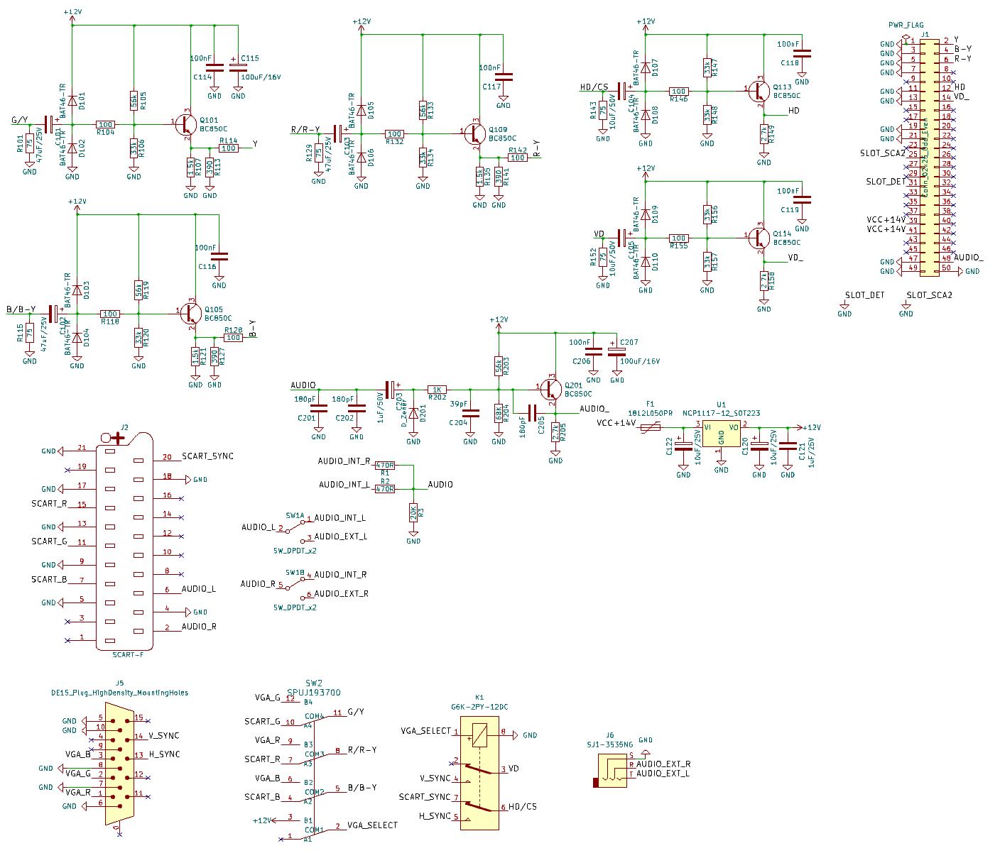
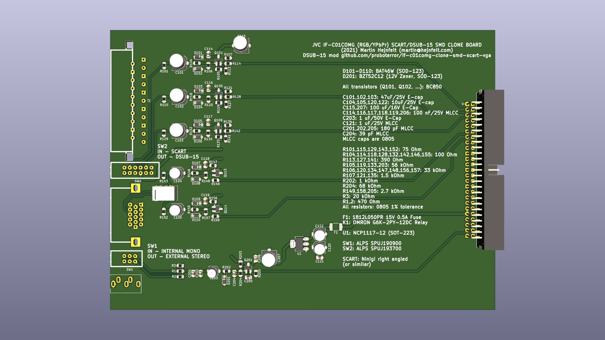
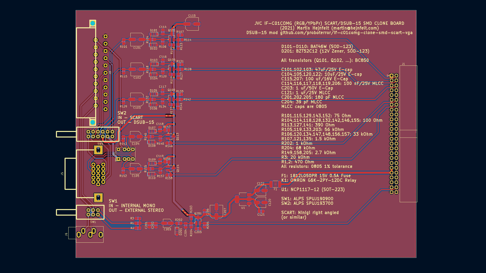

IF-C01COMG Clone board SMD Full size - with SCART and DSUB-15 (VGA 15KHz) inputs. 
Separate H/V and combined sync supported for DSUB-15 input.

BNC connectors option removed 
RCA audio connectors replaced with 3.5 mm audio jack 
Switches changed to ALPS SPUJ190900 / SPUJ193700 

Project migrated to KiCad 8.

## Bill of materials
|Reference|Value|Footprint|Qty|Manufacturer|SKU|
|-----|-----|-----|-----|-----|-----|
|C101,C102,C103|47uF/25V|6.3x5.4|3|PANASONIC|EEEFK1H470XP|
|||||PANASONIC|EEEFK1E470P|
|||||PANASONIC|EEEFK1E470P|
|C104,C105|10uF/50V|5x5.4|2|PANASONIC|EEEFK1H100UR|
|C114,C116,C117,C118,C119,C206|100nF|805|6|MURATA|GRM21BR71H104KA01L|
|C115,C207|100uF/16V|6.3x5.4|2|PANASONIC|EEEFK1C101P|
|C120,C122|10uF/25V|5x5.4|2|PANASONIC|EEEFK1H100UR|
|C121|1uF/25V|805|1|SAMSUNG|CL21B105KBFNNNE|
|C201,C202,C205|180pF|805|3|MURATA|GRM2165C1H181J|
|C203|1uF/50V|4x5.4|1|JB Capacitors|JCK1H010M040054|
|C204|39pF|805|1|MURATA|GRM2165C1H390J|
|D101,D102,D103,D104,D105,D106,D107,D108,D109,D110|BAT46-TR (BAT46W)|SOD-123|10|Diodes|BAT46W-7-F|
|D201|BZT52C12 (12V Zener)|SOD-123|1|Diodes|BZT52C12|
|F1|1812L050PR|Fuse_1812_4532Metric|1|Littlefuse|1812L050PR|
|J1|Conn_02x25_Odd_Even|Pin_Header_Angled_2x25_Pitch2.54mm|1|Connfly|BH-50R (DS1013-50R) (IDC-50MR)|
|J2|SCART-F||1|NINIGI|SCART-17|
|J5|DE15||1||DB15 Female Pins offset 8.5 mm Rows step 2.54 mm|
|J6|SJ1-3535NG||1|KLS Electronic|KLS1-TSJ3.5-008CBA (ST-215N-03)|
|||||KLS Electronic|KLS1-TSJ3.5-008DC (ST-215N-04)|
|||||Dragon City|ST-215N-03/ST-215N-04/ST-215N-03-SL|
|K1|G6K-2PY-12DC||1|OMRON|G6K-2PY-12DC|
|Q101,Q105,Q109,Q113,Q114,Q201|BC850C|SOT-23|6|Diotec|BC850C|
|R1,R2|470R|805|2|YAGEO|RC0805FR-07470RL|
|R3|20K|805|1|ROYAL OHM|0805S8F2002T5E|
|R101,R115,R129,R143,R152|75|805|5|ROYAL OHM|0805S8F750JT5E|
|R104,R114,R118,R128,R132,R142,R146,R155|100|805|8|YAGEO|RC0805FR-07100RL|
|R105,R119,R133,R203|56k|805|4|YAGEO|RC0805FR-0756KL|
|R106,R120,R134,R147,R148,R156,R157|33k|805|7|YAGEO|RC0805FR-0733KL|
|R107,R121,R135|1.5k|805|3|ROYAL OHM|0805S8F1501T5E|
|R113,R127,R141|390|805|3|YAGEO|RC0805FR-07390RL|
|R149,R158,R205|2.7k|805|3|YAGEO|RC0805FR-072K7L|
|R202|1K|805|1|ROYAL OHM|0805S8F1001T5E|
|R204|68K|805|1|YAGEO|RC0805FR-0768KL|
|SW1|SW_DPDT_x2||1|ALPS|SPUJ190900|
|SW2|SPUJ193700||1|ALPS|SPUJ193700|
|U1|NCP1117-12_SOT223|SOT-223|1|ONSEMI|NCP1117ST12T3G|

IF-C01COMG Clone board SMD Full size

This is a full sized version of the IF-C01COMG board for JVC pro monitors (TM-Hxx50CG) and some others...

It's basically the THT base board I made some months ago, with most components changed to SMD.

Credit goes to James Vanderloeff for the dual input idea.

Board is for now completely untested...

Finally this is a Kicad 5.1 project :D

You're welcome to clone, sell, re-design and whatever, see LICENSE.

(2021) Martin Hejnfelt (martin@hejnfelt.com)
This work is free. You can redistribute it and/or modify it under the
terms of the Do What The Fuck You Want To Public License, Version 2,
as published by Sam Hocevar. See the LICENSE file for more details.

